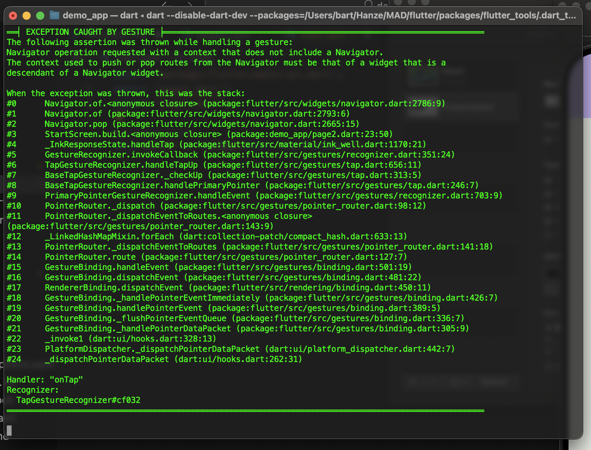

# Transition demo

In deze demo-app maken we gebruik van de [`Navigator`-widget](https://api.flutter.dev/flutter/widgets/Navigator-class.html) om een *stack* van pagina's bij te houden waarbinnen we kunnen navigeren.

In [`main.dart`](lib/main.dart) runnen we een instantie van [`NagivationDemo`](lib/page1.dart) die een `StatelessWidget` laat zien. Hierop zie je (onder de kip) een knop die naar [`StartScreen`](lib/page2.dart) gaat. Als je daar op klikt, schuift de tweede pagina in (als het ware over de eerste pagina heen). Hier staat weer een knop om terug te gaan naar de eerste pagina. Op deze manier kun je een hele navigateboom opzetten.

Als je de `main` direct naar de tweede pagina laat verwijzen (`runApp(const StartScreen());`), staat deze pagina onderaan de stack, dus als je dan op *Terug* klikt, krijg je een foutmelding.

